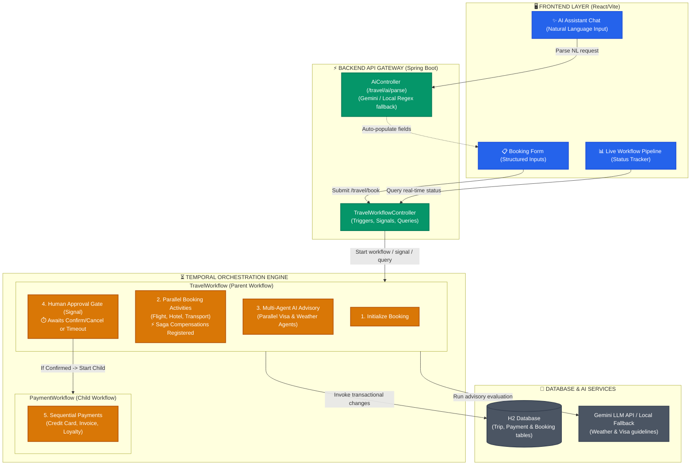
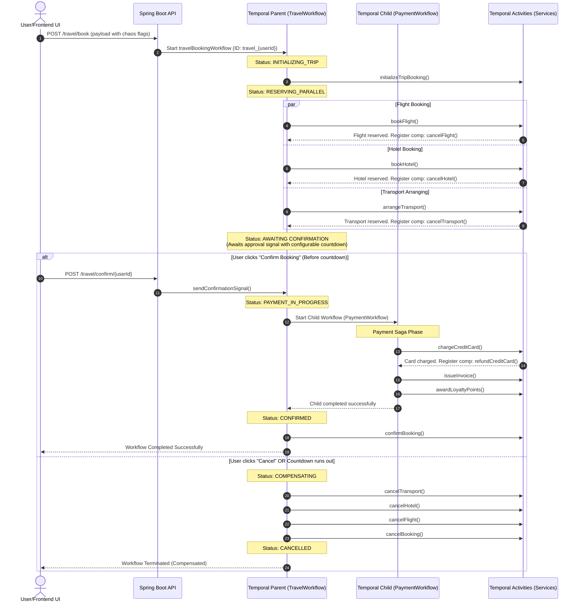

# Premium Travel Booking Portal (Temporal Saga & Parallel Orchestration)

Welcome to the **Premium Travel Booking Portal**, a world-class demonstration of distributed transactions using the **Saga Pattern** with the **Temporal Java SDK**, a **Spring Boot** backend, and a modern, glassmorphic **React/Vite** frontend dashboard.

This monorepo contains two primary components:
1. **`travel_temporal`**: The Spring Boot Java backend that acts as the Temporal client/worker, manages JPA entities, and exposes REST APIs.
2. **`travel-approval-ui`**: The React UI dashboard that provides real-time state visualization, terminal worker logs, simulation controls, and user approvals.

---

## 🏗️ Tech Design & Architecture (Deterministic vs. Probabilistic Orchestration)

The portal combines three design paradigms to offer a premium, robust booking experience:

1. **Deterministic Orchestration (Booking & Payment Saga):** Coordinates transactional systems (Flight, Hotel, Transport, Credit Card, and Invoice systems). Must be 100% deterministic, guaranteeing eventual consistency via the **Saga Pattern** (rollbacks and compensation) and parent/child workflow boundaries.
2. **Probabilistic Multi-Agent Orchestration (AI Risk Advisor):** Coordinates generative AI agents inside Temporal activities to evaluate travel destination safety guidelines (Weather, Visa entry requirements) and synthesizes advice via a Coordinator agent. Latency is optimized by running independent agents in parallel via Java futures, with mock fallbacks for offline safety.
3. **AI Assistive NLP Parser (Form Filler):** Translates conversational natural language requests into structured travel forms dynamically via an extraction agent.

### 📐 High-Level Design (HLD)

The box diagram below illustrates how the frontend layer, backend API gateway, Temporal orchestration engine, and external databases/services interface with each other:



### 🔄 Core Temporal Features Implemented

This project leverages Temporal's most powerful patterns to build a highly resilient, interactive, and distributed transactional process:

1. **Human-in-the-Loop (Human Workflow & Signals)**
   * **Concept:** Instead of running purely automated from start to finish, the booking process pauses and waits for user confirmation (an external manual action).
   * **Implementation:** The workflow blocks execution using `Workflow.await(timeout, () -> confirmed || cancelled);` waiting for a Signal from the controller (`confirm` or `cancel`).
   
2. **Saga Pattern (Compensating Transactions)**
   * **Concept:** Ensures eventual consistency in distributed systems. If a step fails, the system executes compensation logic (reversals) for previously completed steps.
   * **Implementation:** The workflow registers compensation methods (`cancelFlight()`, `cancelHotel()`, `cancelTransport()`) in a `Saga` object. If any booking activity throws an exception, `saga.compensate()` is automatically triggered, rolling back database changes.

3. **Workflow Timers & Automatic Escalation**
   * **Concept:** Human workflows need timeouts so they don't block indefinitely.
   * **Implementation:** The UI lets users dynamically configure the approval timer (from 10s to 300s). The parent workflow uses this duration inside `Workflow.await` to auto-cancel and compensate if the user doesn't respond in time.

4. **Parent/Child Workflow Orchestration**
   * **Concept:** Splitting complex processes into sub-processes facilitates retry control, security boundaries, and modular development.
   * **Implementation:** The payment/invoice flow is executed as a child workflow `PaymentWorkflow` from within the parent `TravelWorkflow`.

5. **Asynchronous Parallel Execution**
   * **Concept:** Speeding up distributed service calls by running non-dependent activities concurrently.
   * **Implementation:** Booking reservations (`bookFlight`, `bookHotel`, `arrangeTransport`) and AI Risk Advisor agents (Weather, Visa checks) execute concurrently via `Async.function(...)` and `CompletableFuture`.

6. **Worker Crash Resilience (State Reconstruction)**
   * **Concept:** If backend nodes or workers crash mid-flight, state is not lost.
   * **Implementation:** Temporal stores the full execution history. Upon restarting a crashed worker, the workflow resumes execution exactly from the last saved state without repeating successfully completed activities.


### 🔍 Low-Level Design (LLD)

#### 1. Deterministic Layer (Transactional Eventual Consistency)
*   **`TravelWorkflow` / `TravelWorkflowImpl`**: Serves as the orchestrator. Dictates the parallel booking execution, compensation registration, and signal wait boundaries.
*   **`PaymentWorkflow` / `PaymentWorkflowImpl`**: Exposes child workflow capabilities to process card charges, invoices, and loyalty records.
*   **`TravelActivities` / `TravelActivitiesImpl`**: Manages entity creation and status mutations in the H2 Database across `trip_bookings`, `flight_bookings`, `hotel_bookings`, and `transport_bookings`.
*   **Saga Compensation Rules:** If `bookHotel` or `arrangeTransport` throws an exception, Temporal catches the application error and executes registered rollbacks (`cancelFlight`, `cancelHotel`, etc.) sequentially.

#### 2. Probabilistic Layer (Parallel Multi-Agent Reasoning)
*   **`AiAdvisoryActivities` / `AiAdvisoryActivitiesImpl`**: Coordinates the risk assessment flow. Spawns two asynchronous tasks in parallel:
    *   **Weather Agent:** Queries seasonal weather ratings.
    *   **Visa Agent:** Validates border entry regulations.
    *   **Coordinator Agent:** Concurrently synthesizes both results.
*   **`PromptConfig` / `prompts.properties`**: Isolates system instructions from Java logic, supporting runtime placeholders (`{origin}`, `{destination}`, `{tripType}`).
*   **`TripBooking.aiAdvisory`**: Configured via `@Column(length = 2000)` in JPA to store markdown text advice securely without database length constraints.

#### 3. AI Assistive Layer (Natural Language Processing)
*   **`AiController.java`**: Implements `/travel/ai/parse` and binds header/environment API keys. Utilizes structural parsing configurations (`responseMimeType: "application/json"`) to query Gemini.
*   **`mockParse(...)`**: High-performance local regex fallback pattern matches travel parameters (dates, guests, destination presets) when offline.

### Transaction Orchestration Workflow



---

## 📁 Projects Explanation

### 💻 1. Frontend: `travel-approval-ui`
A sleek, premium, glassmorphic portal built using React and Vite:
*   **Grouped Pipeline Tracker**: Consolidates sequential steps into a grouped hierarchy showing parallel reservations (`Flight`, `Hotel`, `Transport` pills) and sequential payment steps (`Card Charge`, `Invoice`, `Loyalty` pills).
*   **Worker Log Console**: Simulates terminal logs directly on the web page, making it clear to see when activities are executed, registered for compensation, or rolled back.
*   **Repositioned Controls**: Placed the confirmation/timer card on the right-side gap next to the pipeline to maximize layout efficiency.
*   **Admin Tab**: Aggregates external project components and config controls:
    *   **Workflow Control Panel**: Features an interactive slider to configure the User Confirmation Timeout dynamically (10s to 300s). The UI automatically dispatches a cancel signal if the timer runs out.
    *   **Temporal UI**: Embeds the local Temporal dev server console directly inside the application via an iframe to track workflow execution histories.
    *   **H2 Database Console**: Embeds the H2 database console to view real-time data persistence.
    *   **Swagger UI**: Embeds the backend OpenAPI spec Swagger console to run REST calls directly.

### ☕ 2. Backend: `travel_temporal`
A Java backend built on Spring Boot, integrated with the Temporal SDK and JPA repositories:
*   **`TravelWorkflow`**: Parent workflow coordinating parallel reservations, timer signals, and child execution.
*   **`PaymentWorkflow`**: Child workflow managing sequential credit card charging, invoicing, and loyalty point awarding.
*   **JPA Relational Schema**: Persists state across `trip_bookings`, `flight_bookings`, `hotel_bookings`, `transport_bookings`, `payment_records`, and `loyalty_records` using Hibernate and transaction-safe repository queries.
*   **H2 Local Config**: Automatic configuration via `.h2.server.properties` and reflection-based servlet setup to ensure H2 Console works seamlessly out-of-the-box.

---

## 🛠️ Prerequisites

Before running the application, make sure you have the following software installed:

| Software | Version | Purpose |
| :--- | :--- | :--- |
| **Java JDK** | 21+ | To compile and run the Spring Boot backend. |
| **Node.js & npm** | v18+ / npm 9+ | To compile and serve the Vite frontend. |
| **Docker & Compose** | Latest | To run PostgreSQL and the Temporal Server infrastructure. |

---

## 🚀 How to Run the Application

Follow these steps to set up and run the entire ecosystem locally:

### Step 1: Start Temporal Server (Docker Compose)
The backend uses Temporal Server to manage workflow state persistence.
1. Open a terminal and navigate to the backend subdirectory:
   ```bash
   cd travel_temporal
   ```
2. Start the Temporal Server stack:
   ```bash
   docker compose up -d
   ```
3. Once running, you can access the **Temporal Web Console** at **[http://localhost:8088](http://localhost:8088)**.

### Step 2: Run the Spring Boot Backend
1. Open a new terminal in the backend directory (`travel_temporal`).
2. Build and run the Spring Boot server:
   * **Windows (PowerShell)**:
     ```powershell
     mvn spring-boot:run
     ```
   * **macOS/Linux**:
     ```bash
     ./mvnw spring-boot:run
     ```
3. The API will start on port **`9191`** (e.g. `http://localhost:9191/travel/book`).

### Step 3: Run the React Frontend
1. Open a new terminal and navigate to the frontend directory:
   ```bash
   cd travel-approval-ui
   ```
2. Install the frontend dependencies:
   ```bash
   npm install
   ```
3. Start the Vite development server:
   ```bash
   npm run dev
   ```
4. Open the displayed URL (usually **[http://localhost:5174](http://localhost:5174)**) in your browser.

---

## 📡 REST API Endpoints

The Spring Boot backend exposes the following REST APIs:

*   **Start Booking Workflow**: `POST http://localhost:9191/travel/book`
    *   Body:
        ```json
        {
          "userId": "mahesh_dev",
          "origin": "Paris, France",
          "destination": "Tokyo, Japan",
          "departureDate": "2026-06-15",
          "returnDate": "2026-06-22",
          "travelClass": "Business Class",
          "hotelRating": "5-Star Luxury Resort",
          "transportVehicle": "Tesla Model Y (EV)",
          "travelersCount": 2,
          "includeInsurance": true,
          "simulateFlightFailure": false,
          "simulateHotelFailure": false,
          "simulateTransportFailure": false,
          "simulatePaymentFailure": false,
          "simulateLoyaltyFailure": false
        }
        ```
*   **Query Workflow Status**: `GET http://localhost:9191/travel/status/{userId}`
*   **Send Confirm Signal**: `POST http://localhost:9191/travel/confirm/{userId}`
*   **Send Cancel/Reject Signal**: `POST http://localhost:9191/travel/cancel/{userId}`
*   **Kill Worker Process (Chaos Switch)**: `POST http://localhost:9191/travel/kill`

---

## 🧹 Local Infrastructure DB Cleanup

If you ever see state discrepancies in your local Temporal dev environment and want to perform a clean wipe of the workflow history:

1.  **Stop Containers & Delete Volumes**:
    ```bash
    docker compose down -v
    ```
2.  **Restart Temporal Stack**:
    ```bash
    docker compose up -d
    ```
    This will drop all history records and recreate a clean Postgres db from scratch.
