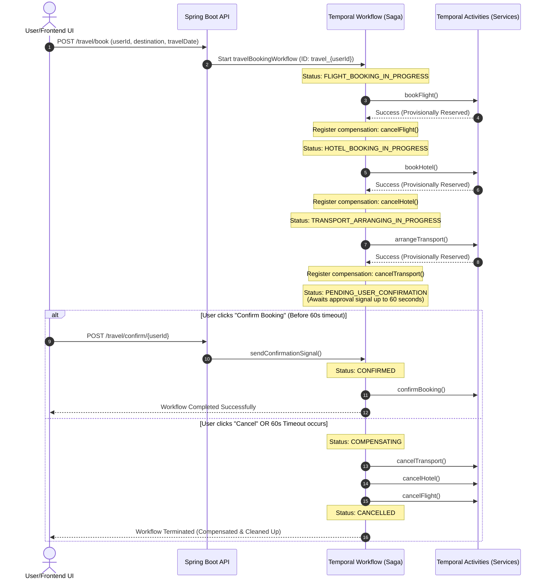

# Travel Booking Portal (Temporal Saga Orchestration)

Welcome to the **Travel Booking Portal**, a world-class demonstration of the **Saga Pattern** orchestrating distributed transactions using the **Temporal Java SDK** and a **Spring Boot** backend, tied to a modern, glassmorphic **React/Vite** frontend dashboard.

This monorepo contains two primary components:
1. **`travel_temporal`**: The Spring Boot Java backend that acts as the Temporal client/worker and exposes REST APIs.
2. **`travel-approval-ui`**: The React UI dashboard that provides real-time state visualization, terminal worker logs, simulation controls, and user approvals.

---

## 🏗️ Tech Design & Architecture

The application demonstrates reliable transaction orchestration across multiple mock services (Flight, Hotel, and Local Transport). If any activity fails or the user cancels, the workflow automatically runs compensation activities in reverse order (rollbacks) to prevent data inconsistency.

### Transaction Orchestration Workflow



---

## 📁 Projects Explanation

### 💻 1. Frontend: `travel-approval-ui`
A sleek, premium, glassmorphic dashboard built using React and Vite.
* **Real-time Pipeline Tracker**: Visually highlights the active step of the Saga transaction (Flight -> Hotel -> Transport -> Approval -> Finalize) with active pulsing glows and status badges.
* **Worker Log Console**: Simulates terminal logs directly on the web page, making it incredibly clear to see when activities are executed, registered for compensation, or rolled back.
* **Offline Sandbox Mode**: Allows developer testing by simulating the backend workflow state machine in the browser when the Spring Boot server is offline.
* **Signal Integration**: Connects to the Spring Boot endpoints to dispatch confirmation or cancellation signals to Temporal.

### ☕ 2. Backend: `travel_temporal`
A Java backend built on Spring Boot, integrated with the Temporal SDK.
* **`TravelWorkflow`**: Coordinates the Saga transaction step-by-step.
* **`TravelActivities`**: Executable units of work that interface with mock databases/APIs to book or cancel flights, hotels, and transport.
* **Controller**: Exposes endpoints to start workflows, query status, and send signals to pending workflows.

---

## 🛠️ Prerequisites

Before running the application, make sure you have the following software installed:

| Software | Version | Purpose |
| :--- | :--- | :--- |
| **Java JDK** | 17 or higher | To build and run the Spring Boot backend. |
| **Node.js & npm** | v18+ / npm 9+ | To compile and serve the Vite frontend. |
| **Docker & Compose** | Latest | To run PostgreSQL and the Temporal Server. |

---

## 🚀 How to Run the Application

Follow these steps to set up and run the entire ecosystem locally:

### Step 1: Start Temporal Server (Docker Compose)
The backend uses Temporal Server to manage workflow state persistence.
1. Open a terminal and navigate to the backend subdirectory:
   ```bash
   cd travel_temporal
   ```
2. Start the Temporal Server stack:
   ```bash
   docker-compose up -d
   ```
3. Once running, you can access the **Temporal Web Console** at **[http://localhost:8088](http://localhost:8088)** to monitor workflows.

### Step 2: Run the Spring Boot Backend
1. Open a new terminal in the backend directory (`travel_temporal`).
2. Build and run the Spring Boot server:
   * **Windows (PowerShell)**:
     ```powershell
     ./mvnw.cmd spring-boot:run
     ```
   * **macOS/Linux**:
     ```bash
     ./mvnw spring-boot:run
     ```
3. The API will start on port **`9191`** (e.g. `http://localhost:9191/travel/book`).

### Step 3: Run the React Frontend
1. Open a new terminal and navigate to the frontend directory:
   ```bash
   cd travel-approval-ui
   ```
2. Install the frontend dependencies:
   ```bash
   npm install
   ```
3. Start the Vite development server:
   * **Windows (PowerShell)**:
     ```powershell
     npm.cmd run dev
     ```
   * **macOS/Linux**:
     ```bash
     npm run dev
     ```
4. Open the displayed URL (usually **[http://localhost:5173](http://localhost:5173)**) in your browser.

---

## 📡 REST API Endpoints

The Spring Boot backend exposes the following REST APIs:

* **Start Booking Workflow**: `POST http://localhost:9191/travel/book`
  * Body: `{"userId": "string", "destination": "string", "travelDate": "YYYY-MM-DD"}`
* **Query Workflow Status**: `GET http://localhost:9191/travel/status/{userId}`
* **Send Confirm Signal**: `POST http://localhost:9191/travel/confirm/{userId}`
* **Send Cancel/Reject Signal**: `POST http://localhost:9191/travel/cancel/{userId}`
